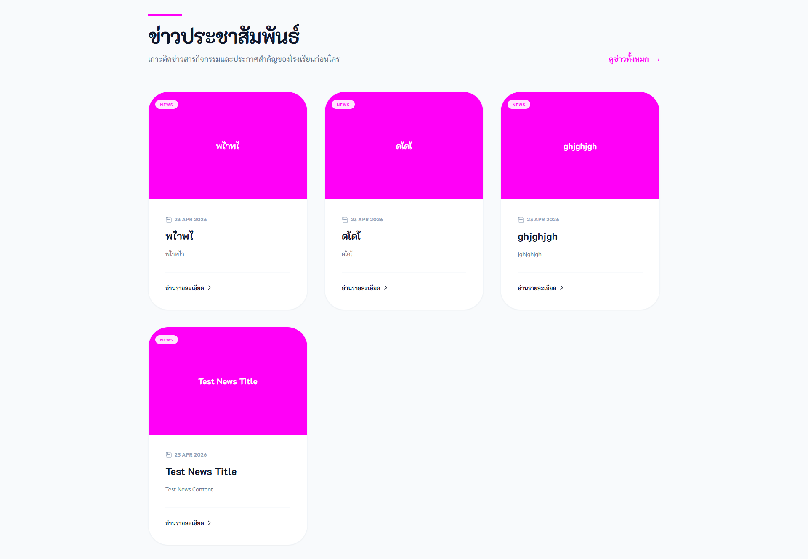
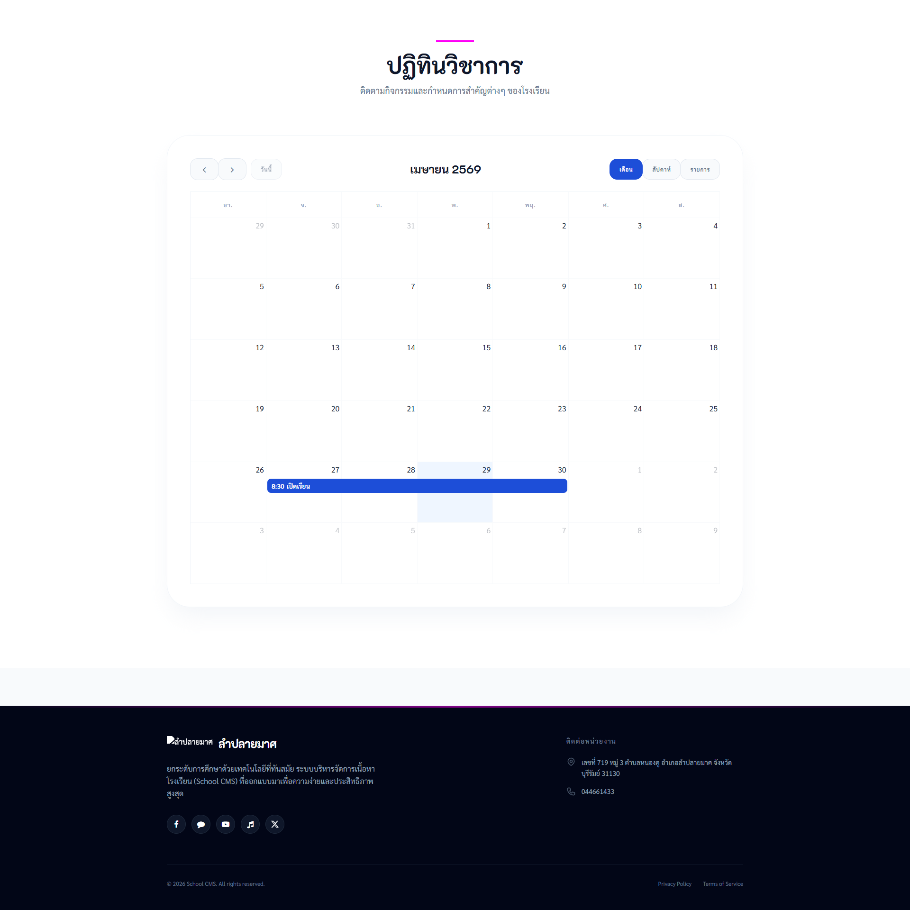
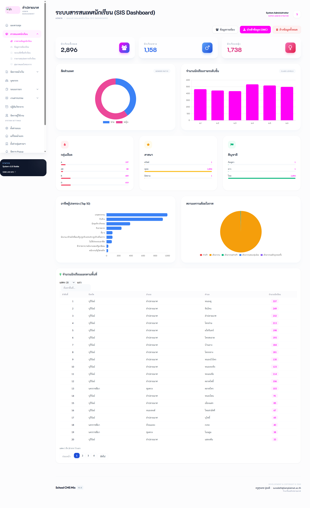
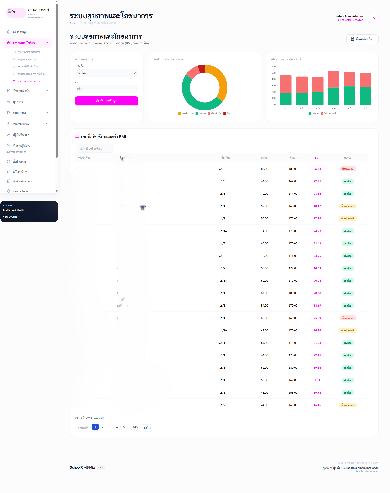
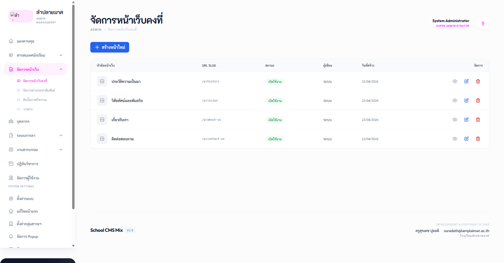
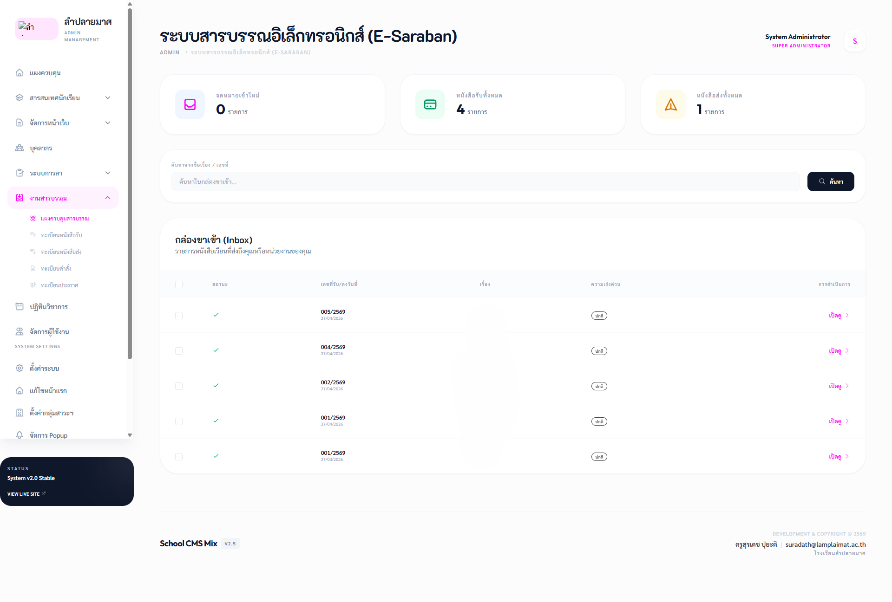

# School CMS Mix V2.6

[](https://www.php.net/)
[](https://tailwindcss.com/)
[](LICENSE)

[**🇹🇭 ภาษาไทย**](#-ภาษาไทย) | [**🇺🇸 English**](#-english)

---

## 🇹🇭 ภาษาไทย

### รายละเอียดโปรเจกต์
**School CMS Mix V2.6** คือระบบบริหารจัดการเนื้อหาเว็บไซต์โรงเรียนที่สมบูรณ์แบบที่สุด พัฒนาด้วย PHP 8.1+ ร่วมกับ Tailwind CSS มอบประสบการณ์การใช้งานระดับพรีเมียม (Premium UI/UX) พร้อมโมดูลสารบรรณอิเล็กทรอนิกส์ (E-Saraban) และระบบลาออนไลน์ที่ครบถ้วนตามระเบียบส่วนราชการ

### ✨ คุณสมบัติเด่น
- **E-Saraban (ระบบสารบรรณ):** ลงทะเบียนรับ-ส่ง, ออกเลขที่อัตโนมัติ, เกษียณหนังสือแบบ Timeline, และระบบเวียนเอกสารดิจิทัล
- **Leave Management (ระบบลาออนไลน์):** เขียนใบลาออนไลน์, คำนวณวันลาอัตโนมัติ (หักวันหยุด), และสรุปรายงานสำหรับ HR
- **Modern UI/UX:** ดีไซน์พรีเมียมด้วย Glassmorphism รองรับการแสดงผลทุกหน้าจอ (Responsive)
- 📊 **Dashboard & Analytics:** สรุปสถิติภาพรวมโรงเรียนในรูปแบบกราฟและตัวเลข
- 👨‍🏫 **SIS (Student Information System):** ระบบจัดการข้อมูลนักเรียนครบวงจร (DMC Compatible)
- 📝 **Attendance System:** ระบบเช็คชื่อเข้าเรียนรายวิชา/รายวัน พร้อมระบบ Upsert กันข้อมูลซ้ำ
- 📈 **Attendance Reports:** รายงานสถิติการเข้าเรียนรายบุคคล/รายห้อง พร้อมร้อยละการมาเรียน
- **Student Health & Nutrition:** ติดตามสถิติน้ำหนัก ส่วนสูง และการคำนวณ BMI อัตโนมัติ พร้อมกราฟวิเคราะห์สถานะโภชนาการแยกตามห้องเรียน (AJAX-powered)
- **User Management & RBAC:** ระบบจัดการผู้ใช้และสิทธิ์แบบ **Multi-Role** (1 ผู้ใช้มีได้หลายบทบาท) พร้อม UI ที่ทันสมัย
- **Academic Calendar:** ปฏิทินวิชาการแสดงผลแบบ Interactive พร้อมรายละเอียดกิจกรรม
- **Entry Popup:** ระบบจัดการป๊อปอัพแจ้งเตือนหน้าแรก (Welcome Popup)
- **Document Submission System:** ระบบส่งเอกสารและผลงานวิชาการ รองรับ Drag & Drop, ตรวจสอบไฟล์ secure MIME, และระบบอนุมัติ/ตีกลับ (Revision) พร้อมส่งออก Excel
- **Easy Installer:** ระบบติดตั้งอัตโนมัติผ่านหน้าเว็บ สะดวกและรวดเร็ว

### 🛠️ เทคโนโลยีที่ใช้
- **Back-end:** PHP 8.1+ (Strict Types)
- **Front-end:** Tailwind CSS, Flowbite, Vanilla JS, Alpine.js, DataTables (Tailwind Integration)
- **Database:** MySQL / MariaDB (InnoDB)
- **Charts:** Chart.js (สำหรับการลาและระบบสุขภาพ)

---

## 🇺🇸 English

### Project Overview
**School CMS Mix V2.6** is a comprehensive School Management System built on PHP 8.1+ and Tailwind CSS. It features a premium UI/UX design with integrated E-Saraban (Electronic Document) and Online Leave Management modules tailored for educational institutions.

### ✨ Key Features
- **User Management & RBAC:** Advanced role-based access control with **Multi-Role support** (1 user can have multiple roles).
- **E-Saraban System:** Digital document registration, auto-numbering, minute-note timeline, and document distribution.
- **Online Leave System:** Digital leave requests, automatic work-day calculation, and HR summary reports.
- **Modern UI/UX:** Premium design using Glassmorphism, fully responsive for all devices.
- **Student Information System (SIS):** Student directory and dashboard with easy CSV import from DMC.
- **Attendance System:** Individual and subject-based attendance tracking with daily reports and percentage calculation.
- **Student Health & Nutrition:** Health monitoring system with auto BMI calculation and nutrition analysis dashboard (AJAX-powered).
- **Academic Calendar:** Interactive school calendar with event management.
- **Document Submission System:** Secure academic document upload system with Drag & Drop, MIME validation, and approval workflow.
- **Easy Installer:** User-friendly web installer for quick deployment.

---

## 📁 โครงสร้างโปรเจกต์ / Project Structure

```text
/cms
├── core/               # Core System (Database, Router, Security)
├── docs/               # Manuals & Documentation
├── modules/            # Functional Modules (Saraban, Leave, Students, Health)
├── themes/             # UI Templates (Default & Admin)
├── uploads/            # Media & Document Storage
├── index.php           # Main Entry Point
└── install.php         # Web Installer Script
```

## 🚀 การติดตั้งระบบ (Installation)
1. อัปโหลดไฟล์ทั้งหมดขึ้นบนเซิร์ฟเวอร์
2. สร้างฐานข้อมูล MySQL (Collation: `utf8mb4_unicode_ci`)
3. เข้าใช้งานไฟล์ `install.php` ผ่าน Browser และทำตามขั้นตอน
4. **สำคัญ:** เมื่อติดตั้งเสร็จแล้ว ให้ลบไฟล์ `install.php` เพื่อความปลอดภัย

## 📖 เอกสารประกอบการใช้งาน (Documentation)
- [🇹🇭 คู่มือการติดตั้ง (Installation Guide)](docs/installation_guide.md)
- [🇹🇭 คู่มือการใช้งาน (User Manual)](docs/user_guide.md)
- [🇹🇭 คู่มือการนำเข้าข้อมูล DMC (DMC Import Guide)](docs/dmc_import_guide.md)
## 📝 Login Credentials (สำหรับทดสอบ / For Testing)
*Username: admin / password: [PASSWORD]
---

### 📸 ภาพตัวอย่างระบบ (System Screenshots)

<div align="center">
    
    
    
    
    
    
    
</div>

---
---
&copy; 2569 **School CMS Mix V2.6**. พัฒนาโดย **ครูสุรเดช ปุยะติ** (โรงเรียนลำปลายมาศ)

---